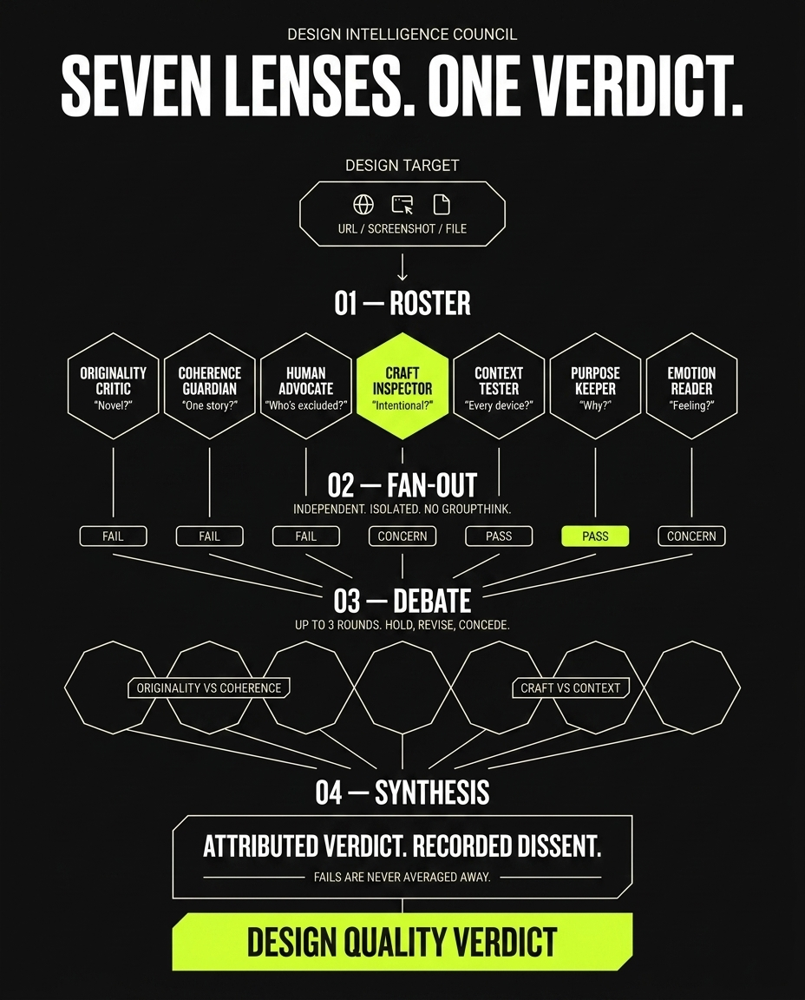

# Design Intelligence Council

A multi-perspective design evaluation system with 7 orthogonal lenses that independently evaluate designs, debate to consensus, and produce synthesized verdicts with recorded dissent. Built on the proven `/council` pattern from [amplifier-bundle-skills](https://github.com/microsoft/amplifier-bundle-skills).



## Installation

Add the Design Council behavior to your bundle:

```bash
amplifier bundle add git+https://github.com/anderlpz/amplifier-bundle-design-council@main#subdirectory=behaviors/design-council --app
```

This installs only the behavior (skills + awareness context) at the app level — no foundation dependency, no context bloat.

Then compose it into your bundle's `bundle.md`:

```yaml
includes:
  - bundle: git+https://github.com/anderlpz/amplifier-bundle-design-council@main#subdirectory=behaviors/design-council
```

## The Seven Lenses

| Lens | Load-Bearing Question |
|------|-----------------------|
| **originality-critic** | Is this genuinely novel, or a competent remix of the obvious? |
| **coherence-guardian** | Do all the design choices tell the same story? |
| **human-advocate** | Who are we excluding? Does this work for real bodies and minds? |
| **craft-inspector** | Is every detail intentional, or are there arbitrary values and unfinished states? |
| **context-tester** | Does this hold up outside the default viewport — on a phone, in sunlight, in motion? |
| **purpose-keeper** | Why does this design choice exist? What is it communicating? |
| **emotion-reader** | Does this make someone feel something, or is it technically correct but hollow? |

## Usage

Convene the council on a design target (a URL, file path, screenshot, DOM Intelligence Package, or self-contained description):

```
/design-council <target>
```

Convene the council on the design you're currently building in this session:

```
/design-council-here
```

`/design-council` forks into an isolated session for cold independent evaluation. `/design-council-here` runs inline so it can see the current conversation context.

## How It Works

1. **Fan-out** — All seven lenses evaluate the design target independently, with no visibility into each other's assessments. This prevents anchoring bias and ensures orthogonal coverage.
2. **Debate** — The lenses see each other's evaluations and engage in up to 3 rounds of structured debate, challenging and refining positions.
3. **Synthesis** — A synthesized verdict is produced with attributed findings from each lens. Dissenting opinions that survived debate are preserved in the final output, not smoothed away.

## Architecture

```
amplifier-bundle-design-council/
├── bundle.md                          # Bundle manifest and description
├── behaviors/
│   └── design-council.yaml           # Composable behavior for bundle includes
├── context/
│   └── design-council-awareness.md    # Grounding context for all lenses
├── docs/
│   └── design-council-workflow_*.png  # Workflow diagrams
├── scripts/
│   └── validate_bundle.py            # Bundle validation script
├── skills/
│   ├── coherence-guardian/            # Consistency lens
│   ├── context-tester/               # Real-conditions lens
│   ├── craft-inspector/              # Detail lens
│   ├── design-council/               # Orchestrator (fork mode)
│   ├── design-council-here/          # Orchestrator (inline mode)
│   ├── emotion-reader/               # Feeling lens
│   ├── human-advocate/               # Inclusion lens
│   ├── originality-critic/           # Novelty lens
│   └── purpose-keeper/               # Intent lens
└── tests/
    └── test_bundle_validation.py      # Bundle validation tests
```

## Part of ADI

This bundle is part of the **Amplifier Design Intelligence (ADI)** vision — a composable design quality studio where deterministic slop detection and semantic design evaluation converge on the same rendered artifact. The Design Intelligence Council serves as a standalone semantic evaluation tier that can also be composed into the full ADI convergence loop.

## Contributing

This project is not currently accepting external contributions.

## License

[MIT](LICENSE)
